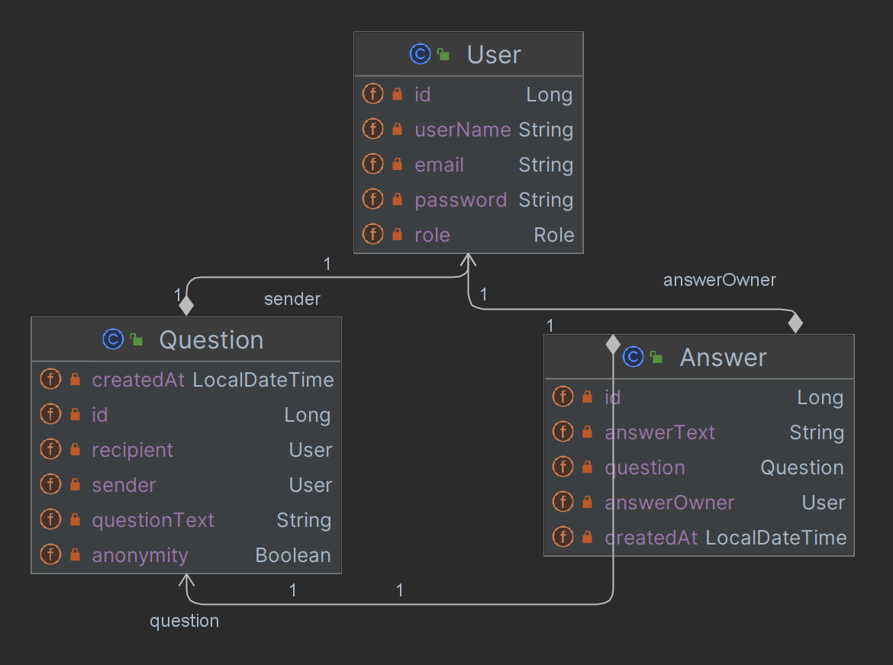
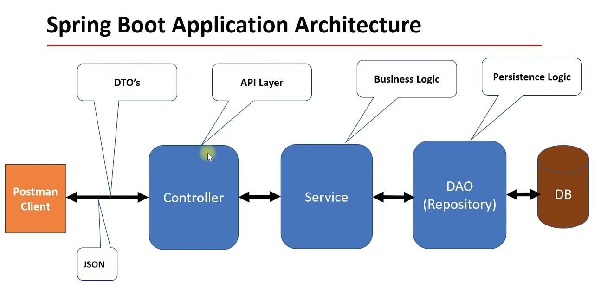
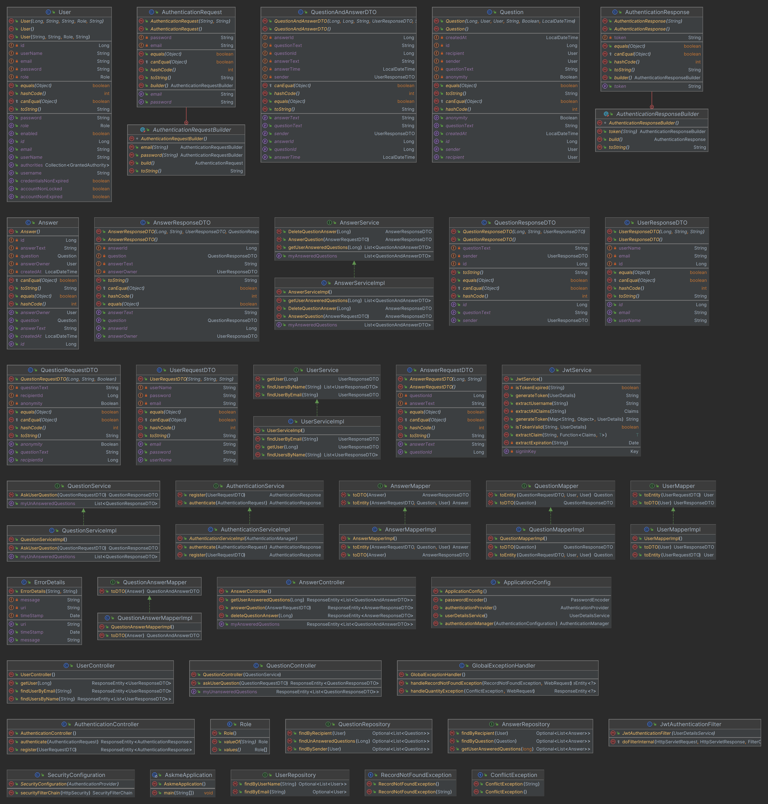
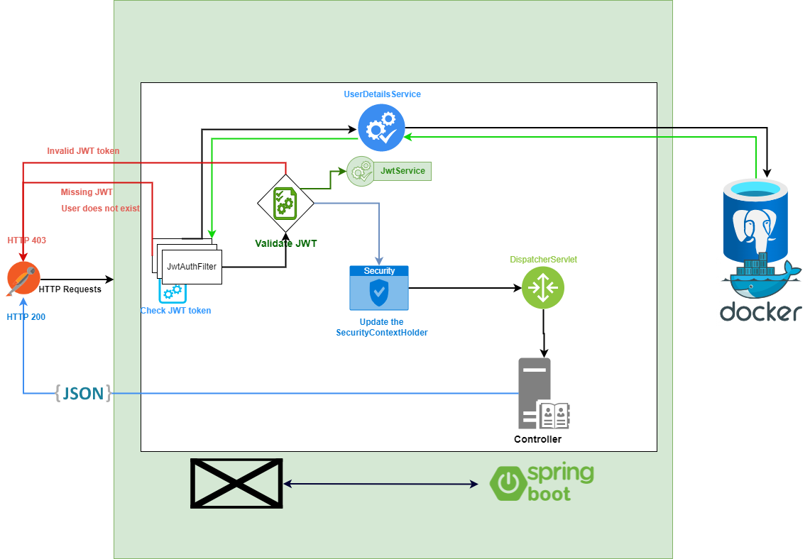

# ask-me project

The idea is a Q/A website where users can send questions
to a user they follow, the user may choose to answer all or some of
these questions, the answers are public to everyone.

### Entity relationship diagram

### project Architecture NTier

### project class diagram

### Security Architecture diagram
